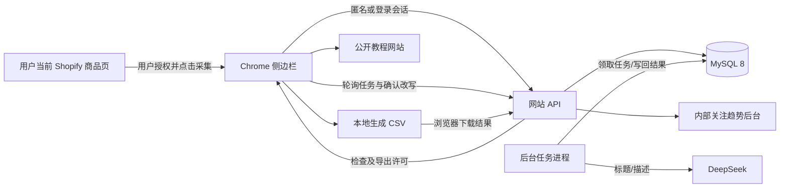

# 技术架构与产品边界

规划日期：2026-09-12。状态：M0 本地骨架已实现，M1 身份服务已编码、待真实数据库/邮件验证；复查记录见 REVIEW.md。详细接口/权限以 CONTRACTS、持久化规则以 DATABASE 为准，本文件不另定义同名字段。

## 1. 产品目标与竞争策略

第一版目标是缩短投手从发现商品到获得可导入草稿的时间，并在导出前指出文本中的风险信号。评价成功不能只看功能数量，应看完整采集率、CSV 实际导入成功率、AI 检查可理解程度和用户回访。

| 参考对象 | 吸收的优点 | runad123 的实现取舍 |
| --- | --- | --- |
| Shopify Scraper & Analyzer | 无登录启动、当前商品导出、紧凑工具面板 | 保留低门槛，服务端签发匿名身份；导出前预览、编辑、风险检查；明确缺失数据和失败原因 |
| Koala Inspector | 结构化商品展示、规格图片处理、账号和额度、收藏及店铺研究路径 | 优先把商品、规格、图片与状态展示清楚；实现基础账号和额度；收藏、监控后置 |
| PPSPY | 当前商品获取及回退思路、插件与网站联动、上下文入口 | 采用有界回退、超时与重试，教程链接带来源参数；不加入广告库和销量预测 |

此前静态分析中发现过部分导出路径有数量上限、部分失败处理可能造成不完整结果、CSV 字段有待实际导入核验。它们是我们必须验证的风险点，不作为“竞品所有版本都存在缺陷”的宣传依据。竞品服务端算法、收入和真实客户量不能由插件代码确认。

我们的差异化组合是：**可靠导出＋最终文本风险提示＋可控改写＋投放教程＋自身用户行为形成的内部趋势数据**。不把“有 AI”本身当壁垒，也不承诺这些功能足以保证竞争胜出。

## 2. 第一版范围

### 必做

- 安装引导、采集及服务端处理告知、当前站点授权。
- Shopify 识别、当前商品标题/HTML 描述/图片/价格/选项/规格采集，来源和完整性展示。
- 单商品预览、手动编辑标题/描述、独立 AI 改写勾选、生成前后对比。
- 服务端 DeepSeek 原始文本检查；最终文本如改变则重新检查；风险说明和确认记录。
- 导出 Shopify 可导入 CSV，默认草稿；必要的导入说明。
- 匿名身份、管理员审核注册与密码登录、匿名模式与强制登录模式切换。
- API 额度、任务进度、成本记录、重试、幂等、错误展示。
- 教程入口、公开教程列表；后台管理教程和相关配置。
- 内部后台查看采集/导出记录、商品关注趋势、AI 成本与失败情况。

### 后置

- 集合/整店批量、批量编辑、选品篮、跨设备历史和模板、多店同款归并。
- 商品监控、价格变化、AI 更多语言模板、Shopify Admin API 直接上传。
- 用户关注 Shopify 店铺后的服务器端新品监控、跨店铺同款聚类、AI 辅助相似商品判断、爆品概率评分和订阅推送。
- 广告库、广告抓取、销量/收入预测、主题复刻、全面应用识别、评论搬运、图片风险检查均不纳入首版。

## 3. 技术选型

| 部分 | 确定方案 | 理由/约束 |
| --- | --- | --- |
| 语言与工作区 | TypeScript strict、pnpm workspace | 插件和服务端复用数据合同及纯函数 |
| 插件 | Manifest V3、Vite、React、原生 Side Panel | 页面样式不会污染面板；不维护注入式浮动大面板 |
| 网站/API | Next.js App Router、Node runtime Route Handlers | 一个服务承载教程、账号、管理后台和 API；禁止数据库接口跑 Edge runtime |
| 后台任务 | 独立 Node 进程，与 API 共用服务层 | DeepSeek 请求不占用浏览器长连接，进程重启后任务可恢复 |
| 数据层 | MySQL 8.0+、InnoDB、utf8mb4；Drizzle stable＋mysql2 | 类型化访问、显式迁移；版本已在 M0 锁定，M1 迁移最低要求 MySQL 8.0.16 |
| 数据校验 | Zod，共享 DTO；服务端再次验证 | 网络和模型响应都不可信 |
| UI | 简洁 React 组件＋CSS；网站可用 Tailwind | 不在首版另建大型设计系统；不引入多个组件库 |
| AI | 服务端 DeepSeek HTTP 适配器 | 风险与改写分任务、模型和 prompt 分版本、便于替换模型 |
| 测试 | Vitest；Playwright 用于必要的网站与插件流程 | CSV/权限/任务恢复等关键路径优先 |
| 部署 | 单 Linux 服务器，HTTPS 反向代理，web＋worker 两进程，连接已有 MySQL | 不要求 Docker/Kubernetes；运行方式在部署阶段按服务器环境落地 |

M0 将 Node、pnpm 和各依赖的确切版本写入工具链配置与 lockfile。不要照抄 ORM 文档中的 RC 安装命令；不要默认新版 ORM 必然支持 MySQL。实际 MySQL 小版本、sql_mode 和时区需在接入时验证。

## 4. 目录和依赖方向

```text
apps/
  extension/      manifest、service worker、content collector、side panel
  web/            公开教程、登录页、后台、/api/v1/*
  worker/         MySQL 任务认领、DeepSeek、周期统计和清理
packages/
  contracts/      Zod 请求/响应、错误码、枚举；不得引用数据库或 Node 专用包
  product-core/   纯函数：商品规范化、CSV 映射、文本比较、规范化哈希输入
  db/             schema、SQL 迁移、连接工厂；仅服务端可引用
  server-core/    身份、业务服务、额度、任务、DeepSeek、日志；仅服务端
docs/
tests/fixtures/  自造/有权使用的商品和 AI 响应样本
```

`extension → contracts/product-core`；`web/worker → server-core → db`。商品 HTML 净化放服务端统一处理，返回安全的预览 HTML；浏览器不能将原始 HTML 直接写入 DOM。跨端只共享纯规范化规则，不把含密钥的模块打进插件。

## 5. 数据流



服务端不主动访问用户提交的任意商品 URL，首版由插件采集公开页面数据。图片只保存 URL，不代理下载、不上传 DeepSeek。这样也避免把任意 URL 抓取器和图片存储引入首版。

后续“关注店铺监控与 AI 爆品信号”是二期能力，不改变首版边界。实现时服务器只扫描用户明确关注或系统纳入监控池的 Shopify 店铺，使用公开 sitemap/products/product .js 等受控入口，做新品发现、跨店铺候选聚类、AI 辅助相似判断和概率评分；结果必须以“疑似/概率”呈现，并保留误判反馈，不把 AI 判断描述为确定事实。

## 6. 插件设计

### 权限与职责

- 最低 Chrome 版本先设 120，M0 核实所用 API 的最低版本。
- 必需：`sidePanel`、`activeTab`、`scripting`、`storage`、`downloads`、`offscreen`；offscreen 仅承担 CSV Blob 生命周期，API 域名使用精确 host permission。
- `optional_host_permissions` 声明 http/https 站点范围，但默认不申请所有网站权限。用户点击工具栏并同意当前站点后，注册该站点检测脚本。
- 在已授权站点自动识别；未授权站点由用户点击插件启动授权。需要“所有网站自动检测”时设置中单独主动授权，不偷偷扩大权限。
- 不要求 cookies、history、webRequest 或任意网页请求拦截权限。
- content script 负责 DOM/页面标记和公开商品数据获取；service worker 负责消息路由、身份、任务引用及下载记录；side panel 负责展示、编辑和交互。
- 不把长任务状态只放 service worker 内存。任务 ID、草稿 ID、下载 ID 映射存 `chrome.storage.local`，重开面板可恢复。
- 含令牌的 local 存储在写入前设置 `setAccessLevel({accessLevel:'TRUSTED_CONTEXTS'})`，不使用 storage.sync 保存令牌。content script 不读令牌、不调用带身份的服务器接口，只提交采集结果；service worker 校验 sender、tabId、origin、消息类型及 schema，不提供任意 URL fetch 代理。
- CSV Blob 在打包的 offscreen 文档内创建，以 BLOBS 理由启用；service worker 调用 downloads 并跟踪终态。终态后撤销 URL，所有下载结束后关闭 offscreen 文档。不得在 service worker 中调用 DOM/URL.createObjectURL，也不得依赖面板始终打开。使用 Chrome 120 可用的 runtime.getContexts 检测文档，不使用较新版本才提供的 hasDocument。

### Shopify 识别与商品获取

1. 结合 Shopify 页面标记、脚本资源、商品 URL 结构进行识别，单个 CDN 字符串不作为唯一证据。
2. 当前页为商品详情时，优先调用同源、带当前 locale 前缀的 Ajax Product `.js` 路径。
3. 必要时使用当前商品 `.json` 或明确结构化数据回退；回退路径逐项实测，不假设永远可用。
4. 不为了找当前商品遍历整个商品目录。不自动绕过登录、验证码、站点限制。
5. 结构化数据只够标题和主图时明确显示“不完整”，不得伪造规格后宣称成功。
6. 支持超时、取消、有限重试和手动重试；导航或切换标签后提示当前数据属于哪个商品。

Shopify Ajax 商品响应有规格数量上限；达到上限、数量信号冲突或回退缺少完整规格时标记 `completeness=uncertain/partial`。首版只允许完整商品导出；提示不支持的原因，不静默丢规格。价格保留当前市场与币种，不做未经确认的换汇。

金额必须按来源接口分别规范化：Ajax `.js` 的整数编码与 `.json` 的十进制金额不能走同一个解析分支。典型 Ajax 12900 → "129.00"；JPY 等不能直接套 ISO 小数位规则猜倍率，M0 用协议夹具和实际页面金额对照后才启用对应适配。币种优先从同源、同 locale 的 cart.js 读取 currency，只提取该字段，购物车内容不上传、不持久保存；无法确认币种则阻止正式导出。回退接口的币种/市场未核实时不能借用 Ajax 的 currency 混合拼接价格。商品获取前后币种发生变化则重新采集。

原始响应中的商品 ID 可能是 JSON number；先 response.json() 再 String() 无法恢复已经损失的精度。来源适配器使用 response.text() 加经验证的无损 JSON 解析，将 ID 和金额直接规范化为字符串，其余计数才按范围转换为 number。夹具包含超过 Number.MAX_SAFE_INTEGER 的 ID，确保不改号。

标准图文实体商品作为首版支持集。识别到必须订阅、礼品卡、依赖应用定制字段或组合商品结构时返回不支持；可选订阅商品只能在清楚标明“仅一次性购买”的前提下采集基础规格。视频、3D 和应用交互不迁移，不能把这种情况标作已完整复制页面。

### 面板信息层级

顶部：网站/商品来源、匿名或登录状态、服务状态。

主体：商品预览 → 标题/描述编辑 → AI 改写两个开关 → 风险结果 → 规格/图片及 CSV 设置 → 导出按钮。

风险结果包含检测范围、命中的原文、原因、建议和状态。始终区分“已完成检查并提示风险”和“服务失败未检查”。教程/帮助/反馈入口固定在底部，导出后展示导入教程；不每次安装升级强制打开推广网页。

### 界面语言：自动选择与手动切换

- 第一版界面按简体中文（zh-Hans）、繁体中文（zh-Hant）、英语（en）实现；词典结构支持以后添加语言。未支持语言回退英语，不显示未经审核的实时 AI 界面翻译。
- 顶栏放地球图标，参考第一个插件截图的位置，选项为“跟随浏览器 / 简体中文 / 繁體中文 / English”。默认跟随浏览器；手动选择即时生效并保存到本地，重启、升级和退出账号不重置。
- 插件自动模式优先 chrome.i18n.getUILanguage()，不可用时取 navigator.language；网站按 Accept-Language 的有效候选及 q 权重匹配，排除 q=0，客户端后续按 navigator.languages。BCP 47 规范化后，zh-Hant/zh-TW/zh-HK/zh-MO 匹配繁体，zh-Hans/zh-CN/zh-SG/zh 匹配简体，en-* 匹配英语；显式脚本标记优先于地区。多候选先找到支持项，全不支持才回退英语，非法值忽略。
- 优先级：手动设置 > 浏览器自动识别 > 英语。保持 auto 值，不把首次识别结果写成手动偏好；自动模式每次打开面板重新解析，手动模式不被浏览器变化覆盖。
- 插件面板使用应用内词典实现即时切换；manifest 名称/描述使用 _locales 和 default_locale，仍跟随 Chrome 自己的语言选择，不假装面板切换能改变浏览器原生权限对话框。字典随插件打包，不下载可执行语言脚本；此能力不需要额外浏览器权限。
- 插件和网站偏好分别本地保存，首版不做账号同步。网站优先级：已有手动选择 > 本次合法 lang 参数 > 浏览器候选 > 英语。lang 不保存成手动偏好；点击“跟随浏览器”时清除当前 lang 影响。cookie 分别记录 preference 和 resolved，首屏与 hydration 使用同一服务端解析值，挂载后才处理浏览器候选变化。插件读完本地偏好再显示正式文案，避免先闪错语言。
- **界面语言、商品输出语言、目标销售国家是三个独立设置。** 切换 UI 不修改商品、CSV 列头/币种，不产生 revision、不触发 AI 或使检查失效。商品输出语言默认 preserve（保持原文语言），首版可选简体/繁体/英语；不改写时无需额外选择语言。
- 按钮、表单、状态、风险级别、验证错误、登录页、空状态与日期/数字格式均覆盖词典；后台同样使用该机制。API 提供稳定 code 和参数，UI 自行翻译，不把服务端中文 message 直接当唯一文案。
- 词典集中于 packages/contracts 的无运行环境依赖子路径 i18n，插件/网站复用 key 和 resolver；manifest 少量词条单独打包。UI 的 zh-Hans/zh-Hant 显式映射 Chrome _locales 目录 zh_CN/zh_TW，default_locale=en。首版词典 key/插值参数必须一致，缺 key 开发检查失败、运行回退英语，不暴露原始插值模板。
- AI 新任务以发起时的 UI 语言作为说明语言 reportLocale。既有风险原因/改写说明保留原输出语言并标注，切换 UI 不额外收费翻译；命中原文 quote 永远保留商品原文。教程文章可以只有原文，标明文章语言，没有译文不假装已翻译。
- 验证码邮件按创建挑战时的 deliveryLocale 模板发送；UI 切换不自动重发。教学链接标题/摘要保留文章实际语言，不增加多语言文章 CMS。

实现依据：[Chrome i18n](https://developer.chrome.com/docs/extensions/reference/api/i18n)。手动切换用应用状态与词典完成，不尝试修改浏览器语言设置。

## 7. 服务端身份与登录开关

配置 `access_mode = anonymous_allowed | login_required`，默认前者。公网 `/config` 仅返回可公开字段。

- 匿名启动：服务端签发高熵、不透明安装会话令牌；本地 installation ID 仅为关联标识，不能当鉴权凭据。
- 匿名会话也接受额度限制；重装会产生新身份，不能宣称可识别同一自然人。
- 注册提交邮箱、密码两次和用途，经管理员审核才创建普通账号，用户随后凭密码登录；暂不接入 SMTP。邮箱未验证，不自动绑定既有用户。网站使用 HttpOnly/Secure/SameSite=Lax cookie；插件使用 Bearer 令牌。原始令牌只交付一次，数据库存 SHA-256 摘要。
- 首版会话续期延长有效期但不更换令牌，需原会话仍有效、账号未禁用；响应丢失可安全重试。退出/禁用明确撤销，过期重新认证。暂不实现“立即撤销旧 token 的自动轮换”，避免弱网下丢失匿名身份。
- 密码独立盐与 scrypt 哈希；注册 IP/邮箱/全局限速，登录 IP/邮箱限速。密码验证正确后才返回待审核或已拒绝状态。密码计算在全局身份锁外，签发事务重新核验凭据及审核状态。
- 旧邮箱验证码 HTTP 接口关闭，返回 REGISTRATION_REVIEW_REQUIRED；遗留邮件适配器只用于历史兼容/内部测试，不能绕过审核。无 SMTP 依赖、邮件通知、自动密码找回。
- 新用户默认为普通角色；管理员只能通过运维初始化，不允许公开注册时指定角色。
- 当前密码登录不关联匿名历史；不同匿名身份不能凭客户端提交 ID 合并。历史关联功能保留内部实现，未来独立入口需明确同意。
- 所有业务 API 每次校验当前配置与主体权限；worker 执行付费任务前再次校验。开启强制登录后，已有匿名令牌不能绕过；已完成的个人任务状态仍可读取，导出许可与新 AI 操作须登录。
- 匿名用户正在排队的 AI 任务在强制登录后变为 `blocked_auth`，释放额度预留；同一安装登录并同意关联历史后可显式恢复。不同意关联可重新采集建立账号草稿。正在请求 DeepSeek 的任务可能已产生费用，允许结果落库，但导出仍受登录要求控制。
- 后台开启强制登录无需邮件服务；须先完成注册审核迁移及审核账号的真实登录验收。首版后台只允许改白名单配置，不能编辑任意环境变量或密钥。

此开关控制官方客户端和我们的服务，不可能阻止别人修改客户端自行生成 CSV。因此服务端保护的是 AI、账号、额度和数据服务，不能把插件加密当安全方案。

## 8. DeepSeek 和任务执行

### 两类任务

`risk_check`：检查标题和描述中的品牌/授权暗示、仿冒或官方关系表述、可疑受保护名称等文本信号；输出疑似风险及复核建议。没有商标数据库查询、图片判断和人工法律结论。

`rewrite`：只改用户勾选的字段。必须保留原有尺寸、材料、数量、兼容性等事实，不编造认证、功效或销量；移除品牌词不能被描述为“保证规避侵权”。输出草稿，用户选择接受后才覆盖。

### 执行与边界

M3 实现：Next 负责创建/读取/取消/显式重试；独立 Node worker 轮询 MySQL 任务并续租、记 attempt、调用 DeepSeek 和结算；配置及价格在 settings.ai_risk，API key 只在 worker 环境。无配置保持关闭。插件关闭只停止轮询；新开从草稿取 request 恢复。具体当前验收见 M3_VALIDATION.md，真实模型和质量评估未通过前不宣称生产可用。

- DeepSeek base URL、模型名、超时和每类任务额度由服务端配置。风险、改写模型分别配置，接入时核实实际账户可用模型，不硬编码猜测的模型名。
- 使用官方支持的结构化 JSON 输出方式；JSON mode 仍需 Zod 验证。空内容、截断、未知枚举、非法结构均算失败。
- 输入商品文本是待分析数据，不能覆盖系统指令。模型无工具权限、不访问商品中夹带的链接。
- 原始 HTML 先统一净化并抽取可见文本；保留品牌和兼容性上下文。首版单次纯文本最多 20,000 Unicode 字符，超出返回明确错误，不截取后宣称全文已检查。
- 单请求超时初始 90 秒，最多 3 次总尝试，仅重试超时、限流、服务错误或一次结构化输出修复；使用退避和抖动。确定的参数/鉴权错误直接失败。
- 字符数限制不是 token 上限：适配器须同时配置输入 token 预算、输出上限和上下文余量。风险结果与改写 HTML 分别设输出上限；无法容纳完整文本时提前返回不支持，不能靠截断完成检查。每次真正发出调用前持久记录 attempt，崩溃恢复也不得重置 3 次上限。
- 每个任务记录模型、prompt/schema 版本、token 用量、耗时、供应商请求 ID（若有）和成本估算；模型价格作为有生效日期的后台配置，缺失时成本为 unknown，不填零。
- 缓存只有成功结果才可使用；缓存键含任务类型、完整规范化输入、目标国家、语言、模型、prompt/schema 版本。风险缓存有效期初始 7 天，可配置；不缓存失败为“低风险”。
- 相同主体、相同内容的并发请求在数据库去重；首版不跨账号或跨匿名安装共享 AI 缓存，以简化权限、计费和数据删除。同账号不同草稿可以复用有效结果。

### MySQL 队列

- API 在事务中创建任务并预留额度，立即返回 202；插件轮询 2 秒起，逐渐到 10 秒，关闭面板后停止轮询，重开可恢复。
- worker 使用短事务 `SELECT ... FOR UPDATE SKIP LOCKED` 领取任务，提交后才请求外部 AI；网络等待期间不持有行锁。
- 任务有 lease、worker 标识、fencing token、attempts、next_run_at。初始租约 120 秒，每 30 秒续租；只有仍持有该 token 的 worker 可以提交结果。
- worker 崩溃后租约到期可重新领取；数据库业务结果幂等。外部 AI 在响应丢失时可能被重复计费，不能宣称端到端 exactly-once。
- 预留/实际用量/释放在事务中更新。日预算达到上限时暂停新的 AI 操作，已失败任务不能无限重试；已发出供应商调用的失败任务占一次计算额度，未发出即取消或阻塞才释放次数。

M4 风险和改写复用同一 MySQL worker、attempt 与费用结算机制，按 jobs.kind 选择配置、prompt 和输出 schema。改写候选净化后仅写 job.result_json，用户接受才调用草稿 PATCH；插件中的两个任务面板按 kind 分开恢复。计算次数分别限额，全局 USD 日预算合并。配置和字段以 DATABASE/CONTRACTS 为准。

## 9. CSV 与导出规则

- 使用 Shopify 官方当前导入模板作为映射依据，开发时下载并固定测试夹具；最终以真实开发店导入结果验收。
- 默认 `Status=draft`、不发布。允许显式选择其他状态的功能后置。
- 金额为十进制字符串，不用 JS 浮点直接运算；明确显示来源币种与目标店币种需要一致，首版不自动换汇。
- 商品 handle 默认由标题和短稳定来源指纹生成；允许编辑并提示同 handle 可能覆盖目标店商品，首版无法查询目标店是否已存在。
- handle 仅在初建草稿时生成，改写标题不自动改变 handle。重量、是否需要运输和税务相关值只有确认来源时才映射；未知不填猜测值，具体省略列和默认行为须通过 CSV 探针验证。
- 保留选项名称/值、规格顺序、SKU（可选择清空）、图片顺序和规格图片关联；库存未知就不伪造真实库存。首版不声明跟踪对手库存，也不导出虚构条码或供应成本。
- 去掉来源 HTML 中脚本、跟踪器、表单、危险 URL；保留可安全展示的基本段落、列表与图片。外链和来源店品牌单独提示，不能盲目删兼容性事实。
- 规范处理双引号、逗号、换行、UTF-8 和表格公式注入。CSV 引号转义不等于公式防护；对可能触发公式的普通文本字段作可解释的安全处理，公式防护后的标题/描述仍需纳入最终文本检查。
- 图片链接可能失效，必须明确 CSV 引用远程图片；不声称已永久保存素材。服务端不额外下载图片。
- 服务端签发短期导出许可，绑定用户/安装、草稿版本、最终导出内容哈希及风险检查。插件只下载被许可的同一份版本；修改任何字段后重新请求许可，修改标题/描述后重新检查。
- 浏览器创建下载、完成下载、用户导入 Shopify 是三个不同事件；我们只能观察前两者，不能把下载成功显示成导入成功。

## 10. 网站、统计与教程

- 公开页：产品说明、教程列表/详情或外部文章链接、隐私说明、登录。
- 普通账号：基础账号和当前安装信息；历史选品工作台后置。
- 管理后台：登录模式、日额度/预算、教程链接、任务/错误、商品热度、用户与安装概览、管理员审计。
- 教程 URL 限 HTTPS，由管理员配置允许的目标域名；可以带固定 UTM 来源和场景，不把邮箱、访问商品完整 URL 或会话令牌塞到外链参数。
- 热度仅用于内部后台，首版不公开用户是谁、何时爬了哪个品。
- 同店产品以规范化店铺域名＋source_product_id 为主键；没有可靠 source_product_id 的不完整回退不能进入正式热榜。跨域同款第一版不自动合并。
- 主榜为选定时间段内“完成导出的去重主体数”，另列“采集去重主体数”和次数。匿名安装与已登录账号拆开展示，均不叫买家数、销量或爆品保证。
- 原始事件精确计算窗口 distinct；每日汇总只保留趋势归档，M6 最近 7 天图表直接按原始事件 UTC 日期分组。不能把每日去重人数相加当成 7 天去重人数。

M6 路由为 `/tutorials`、`/guide`、`/privacy`、`/account` 和 `/admin`；插件公开教程区只发向固定 API origin，不附认证信息，教程网络失败不影响商品模块。插件最多展示首批 20 条，并通过固定网站入口查看完整列表；可带 utm_source=extension，不能带身份/商品信息。

维护 worker 只需 MySQL 与 AUTH_SECRET 即可运行，未提供 DeepSeek key 时只做维护；提供 key 也需服务端 AI enabled 才会实际外呼。维护异常单独记录不含敏感值的错误码，不阻止下一轮 AI 队列领取。当前真实主环境仍缺部分配置，进程可构建不代表已持续执行后台清理。

## 11. 隐私、运行与恢复

- 首次使用清楚告知：为检查和统计，上传用户主动采集的商品标题、描述、来源、必要商品数据以及操作事件；文本发送给 DeepSeek。不同意则不启动服务端采集流程。
- 不上传一般浏览历史、网页 cookies、广告账户数据。后台看板权限独立，匿名也不代表不产生个人相关数据。
- 日志默认只有 requestId、主体内部 ID、任务类型、耗时、错误码；文本正文只放业务表，不复制进普通日志。
- 商品来源 URL 入库前删除 tracking、fragment、用户信息和非必要查询参数，variant 选择单独记录；不能把含临时 token 的原始地址当日志或教程参数。预览远程图片只在用户查看时加载，并使用 no-referrer。
- 公网所有流量 HTTPS；生产密钥从进程环境读取。浏览器 API 校验鉴权、Origin/CORS、输入和额度；CORS 不能代替鉴权。
- 网站写操作校验 Origin 和 CSRF token；插件 Bearer 路径不接受 cookie 代替鉴权。CORS 仅放行配置的网站与正式/开发插件 ID。
- `GET /health/live` 仅报告进程；`GET /health/ready` 检查 DB 和 worker 最近心跳，不在健康检查时调用收费 AI。详细诊断只给管理员。
- DB 每日备份并定期在隔离库演练恢复；启用可用的 binlog/PITR 能力由实际 MySQL 运维环境决定。备份不可与唯一数据库存放在同一个故障点。
- 先迁移后启动新服务；迁移尽量向后兼容；保留上一版构建。暂停新任务时不丢失已有任务，worker 收到停止信号后停止领取并处理租约。

## 12. 官方依据与实施时复核点

- [Chrome Side Panel](https://developer.chrome.com/docs/extensions/reference/api/sidePanel)：权限和 API 版本。
- [Chrome activeTab](https://developer.chrome.com/docs/extensions/develop/concepts/activeTab)：用户手势授权边界。
- [Chrome storage](https://developer.chrome.com/docs/extensions/reference/api/storage)：local 默认对 content scripts 可见，必须收紧令牌存储访问。
- [Chrome offscreen](https://developer.chrome.com/docs/extensions/reference/api/offscreen)：后台 Blob 文档及版本边界。
- [Chrome 网络请求](https://developer.chrome.com/docs/extensions/develop/concepts/network-requests)：content script 与扩展后台的请求权限不同。
- [Shopify Ajax Product](https://shopify.dev/docs/api/ajax/reference/product)：locale、规格数量及市场价格。
- [Shopify CSV](https://help.shopify.com/en/manual/products/import-export/using-csv)：实际导入字段和约束。
- [Next.js 身份验证指南](https://nextjs.org/docs/app/guides/authentication)：服务端鉴权边界。
- [Drizzle MySQL](https://orm.drizzle.team/docs/mysql/get-started-mysql)：mysql2 支持；注意稳定版与 RC 区别。
- [MySQL 锁定读取](https://dev.mysql.com/doc/refman/8.0/en/innodb-locking-reads.html)：SKIP LOCKED 任务领取。
- [DeepSeek JSON mode](https://api-docs.deepseek.com/guides/json_mode/)：结构化输出仍须处理空结果并校验。

以上是设计依据，不代表已经验证当前服务器、全部 Shopify 主题或真实 AI 结果。

## 网站概览中的推广链接

主题识别值在插件内按网站每日缓存；插件将主题名发送本服务查询运营配置。MySQL settings.theme_links 为唯一配置源，管理 UI 和 API 在现有 Next.js 服务内。查询与网站读取分离，无新增微服务、外部爬取或佣金平台集成；只展示管理员配置的已启用链接，匹配不确定时保持普通主题文字。
